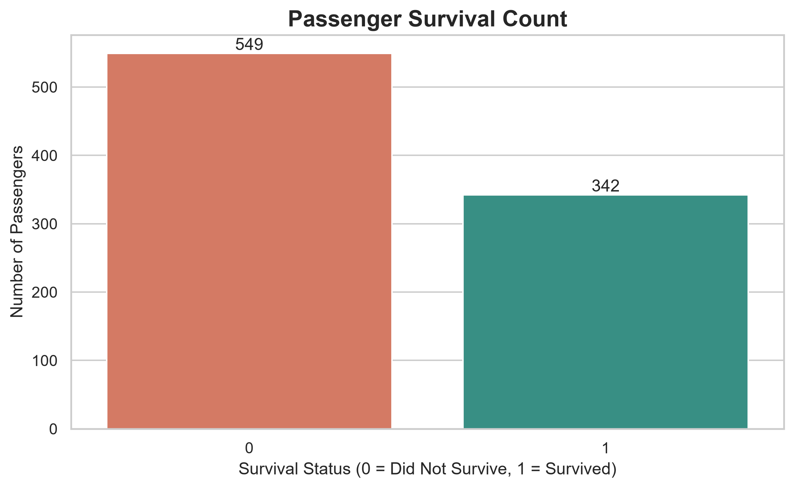
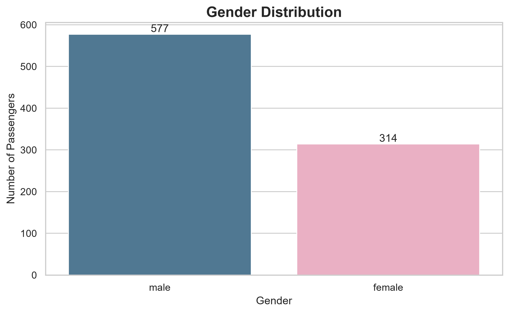
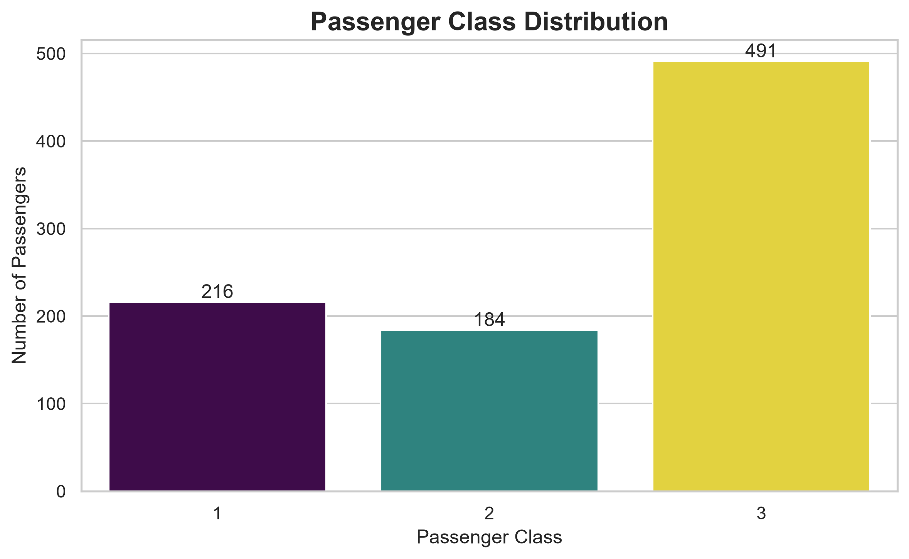
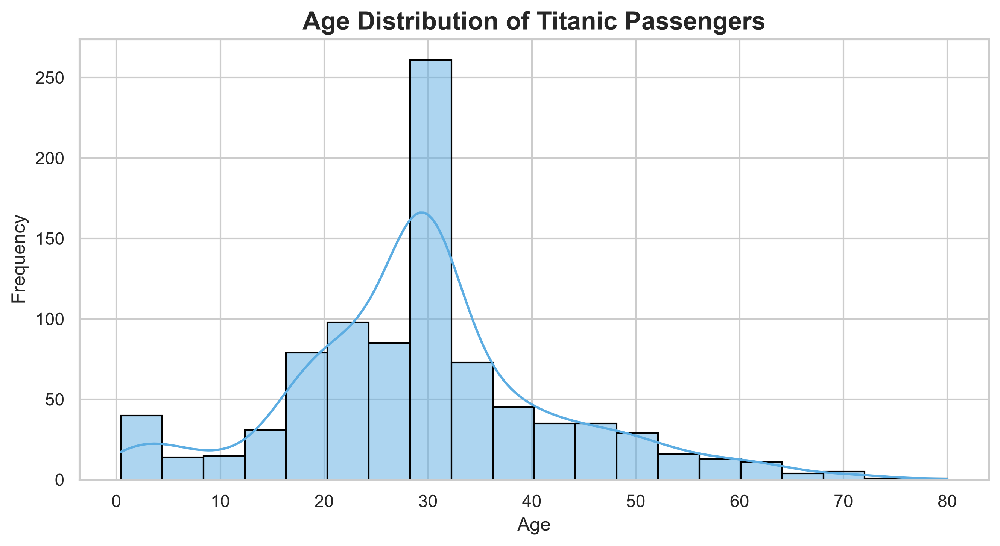
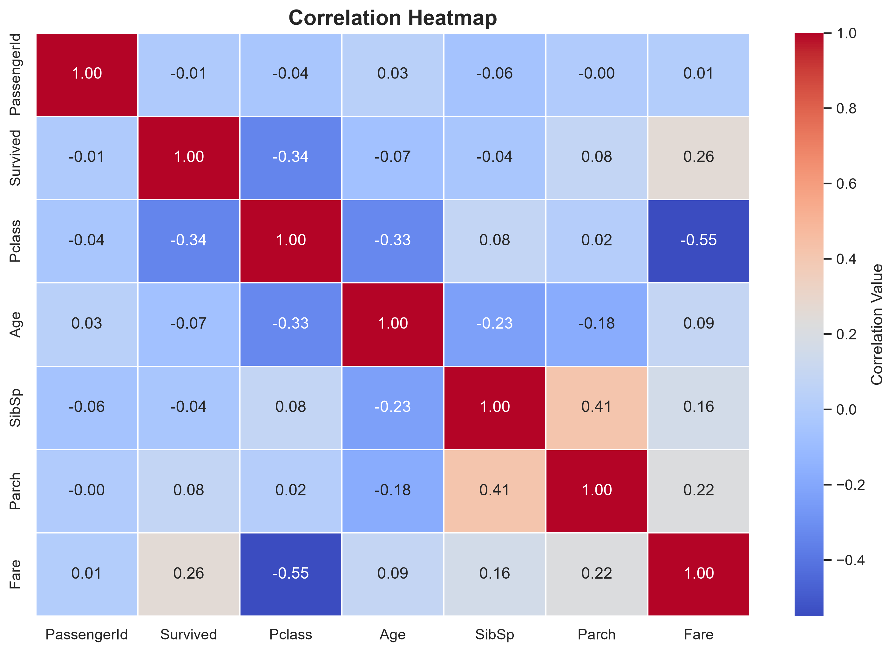
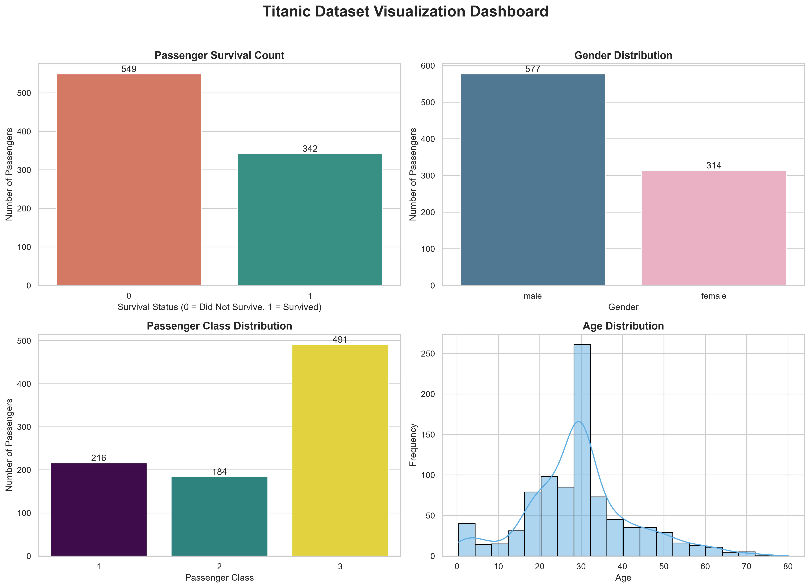

# CodeAlpha Data Analytics Internship Projects
A collection of data analytics projects completed during my CodeAlpha internship using Python, Pandas, Matplotlib, Seaborn, and TextBlob.


## 📌 Project Overview

This repository contains the projects completed during my **CodeAlpha Data Analytics Internship**.

## 🚀 Skills Demonstrated

- Data Cleaning
- Exploratory Data Analysis (EDA)
- Data Visualization
- Statistical Analysis
- Sentiment Analysis (NLP)
- Python Programming
- Pandas & NumPy
- Matplotlib & Seaborn
- TextBlob

## 📂 Projects Included

### 1. Exploratory Data Analysis
Performed data cleaning, missing-value handling, statistical analysis, and exploratory visualization on the Titanic dataset.

### 2. Data Visualization Dashboard
Created a professional dashboard to present important Titanic dataset insights in a clear visual format.

### 3. Sentiment Analysis
Used TextBlob to calculate polarity and subjectivity and classify text sentiment.

The internship focused on solving real-world data analytics problems using Python. The projects demonstrate skills in data cleaning, exploratory data analysis (EDA), data visualization, and sentiment analysis.

---

# 📂 Project Structure

```
CodeAlpha_DataAnalytics
│
├── Dataset
│   └── Titanic-Dataset.csv
│
├── Task2_EDA
│   ├── eda.py
│   ├── REPORT.md
│   ├── survival_count.png
│   ├── gender_distribution.png
│   ├── passenger_class.png
│   ├── age_distribution.png
│   ├── fare_distribution.png
│   └── heatmap.png
│
├── Task3_DataVisualization
│   ├── dashboard.py
│   ├── dashboard.png
│   └── REPORT.md
│
├── Task4_SentimentAnalysis
│   ├── sentiment_analysis.py
│   └── REPORT.md
│
├── requirements.txt
└── README.md
```

---

# ✅ Tasks Completed

## 📊 Task 2 - Exploratory Data Analysis

✔ Dataset Exploration

✔ Data Cleaning

✔ Missing Value Handling

✔ Statistical Summary

✔ Correlation Analysis

✔ Data Visualization

---

## 📈 Task 3 - Data Visualization

Dashboard Created Using

- Survival Count
- Gender Distribution
- Passenger Class Distribution
- Age Distribution

---

## 😊 Task 4 - Sentiment Analysis

Using **TextBlob**

- Positive Reviews
- Negative Reviews
- Neutral Reviews

---

# 🛠 Technologies Used

- Python
- Pandas
- NumPy
- Matplotlib
- Seaborn
- TextBlob

---

# 📊 Key Insights

- Most passengers belonged to Passenger Class 3.
- Majority of passengers did not survive.
- Male passengers were more than female passengers.
- Most passengers were between 20–35 years old.
- Fare distribution is highly right-skewed.
- Missing values were cleaned successfully.

---

# ▶ How to Run

Clone Repository

```bash
git clone https://github.com/ganeshjadhav845904/CodeAlpha_DataAnalytics.git
```

Install Libraries

```bash
pip install -r requirements.txt
```

Run EDA

```bash
python Task2_EDA/eda.py
```

Run Dashboard

```bash
python Task3_DataVisualization/dashboard.py
```

Run Sentiment Analysis

```bash
python Task4_SentimentAnalysis/sentiment_analysis.py
```

## 📸 Project Screenshots

### 📊 EDA Visualizations

#### Survival Count


#### Gender Distribution


#### Passenger Class Distribution


#### Age Distribution


#### Correlation Heatmap


### 📈 Dashboard




---

# 👨‍💻 Author

**Ganesh Jadhav**

CodeAlpha Data Analytics Intern

---

⭐ If you like this project, don't forget to give it a Star.